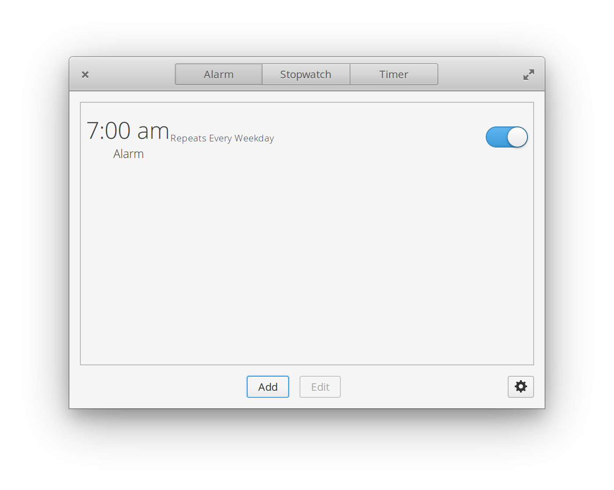
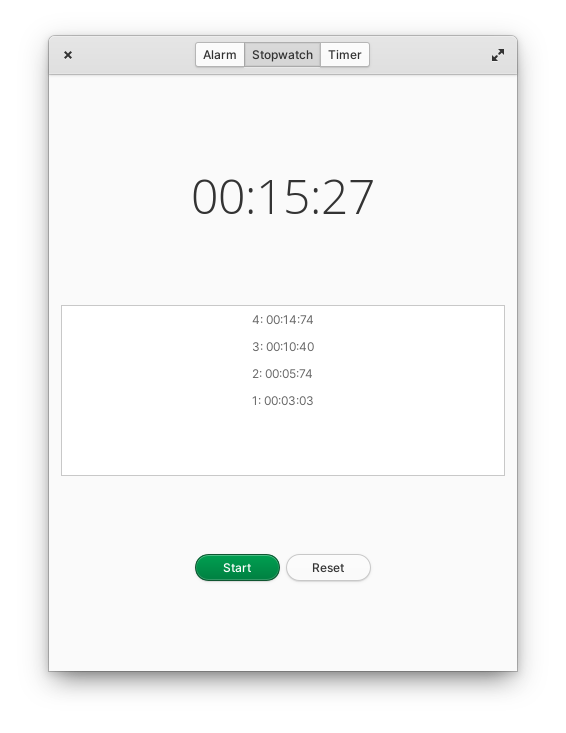
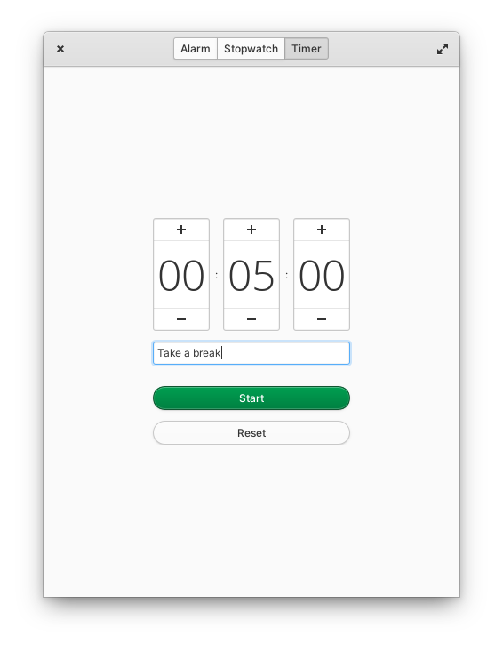

# Hourglass
Hourglass is a simple time keeping application designed for elementary OS.

Author: [Samuel Thomas](https://github.com/sgpthomas) \<sgpthomas@gmail.com\>





## Installation
### For Users
On elementary OS? Click the button to get Hourglass on AppCenter:

[](https://appcenter.elementary.io/com.github.sgpthomas.hourglass)

### For Developers
You'll need the following dependencies to build:

* libgranite-7-dev (>= 7.1.0)
* libgtk-4-dev
* meson (>= 0.57.0)
* valac

Run `meson setup` to configure the build environment and run `ninja` to build

```bash
meson setup builddir --prefix=/usr
ninja -C builddir
```

To install, use `ninja install`, then execute with `com.github.sgpthomas.hourglass`

```bash
ninja install -C builddir
com.github.sgpthomas.hourglass
```
