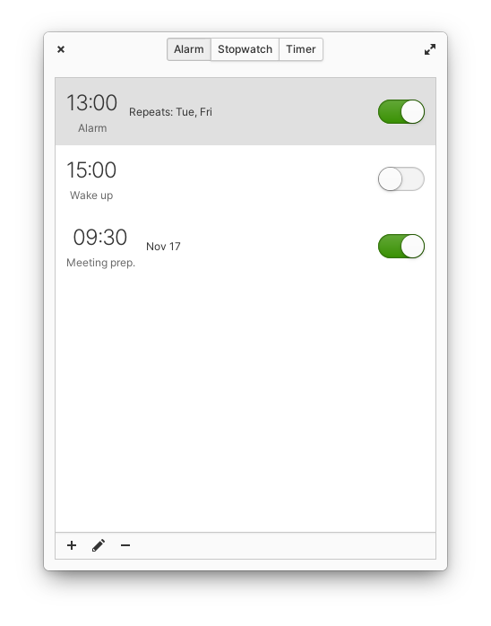
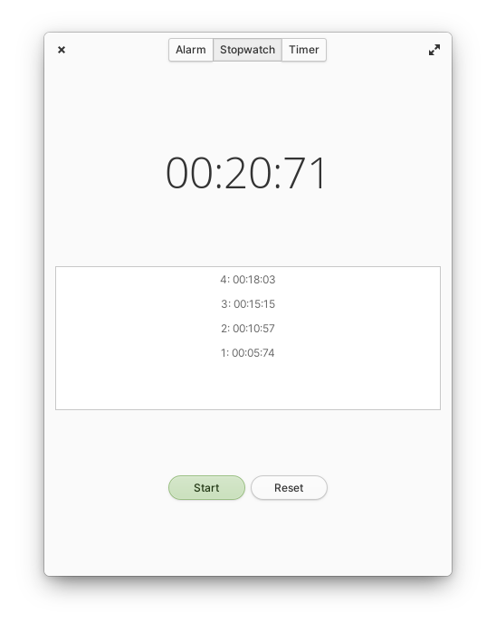
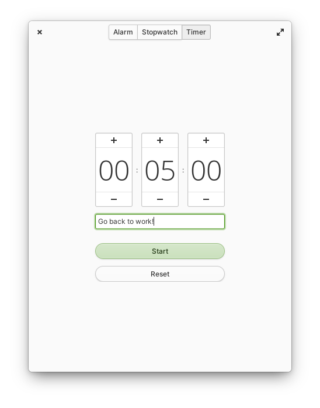

# Hourglass
### A simple time keeping application designed for elementary OS
##### Author: Sam Thomas <sgpthomas@gmail.com>

-------------------------------------------
### Current Features
 * Alarms
 * Stopwatch
 * Timer

-------------------------------------------
### Installation

#### Install From Source
You'll need the following dependencies to build:
* libcanberra-dev
* libgranite-dev
* libgtk-3-dev
* libnotify-dev
* meson
* valac

Run `meson build` to configure the build environment and then change to the build directory and run `ninja` to build

    meson build --prefix=/usr 
    cd build
    ninja

To install, use `ninja install`, then execute with `com.github.sgpthomas.hourglass`

    sudo ninja install
    com.github.sgpthomas.hourglass

-------------------------------------------
### Planned Features
